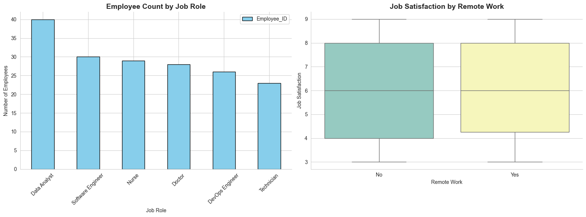
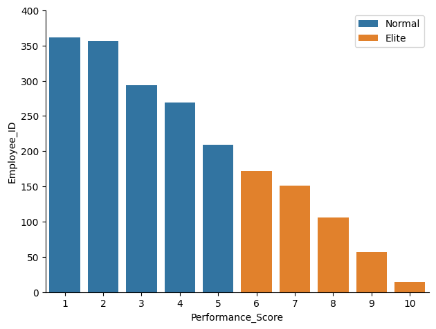
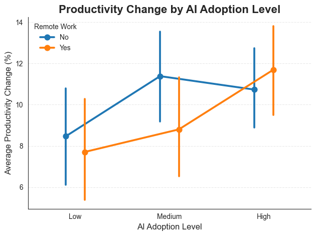

# The Analysis

## 1. How do different data roles compare in terms of salary risk and benchmarking?

This analysis explores the financial risk and reward profiles of the top data roles by comparing their median salaries against the spread (standard deviation) of those salaries.

View my notebook with detailed steps here: [Benchmarking_&_Risk.ipynb](Benchmarking_&_Risk.ipynb)

### Visualize Data

```python
fig, ax = plt.subplots(1,2,figsize=(16,6))

sns.set_style("whitegrid")

df_plot1 = df_merge.groupby("Job_Role")["Employee_ID"].count().sort_values(ascending=False).to_frame()

df_plot1.plot(kind="bar", ax=ax[0], color="skyblue",edgecolor="black")
sns.boxplot(x='Remote_Work', y='Job_Satisfaction', data=df_merge, hue="Remote_Work", palette="Set3", ax=ax[1])

ax[0].set_title(
    "Employee Count by Job Role",
    fontsize=14,
    weight="bold"
)
ax[0].set_xlabel("Job Role")
ax[0].set_ylabel("Number of Employees")
ax[0].tick_params(axis='x', rotation=45)
ax[0].spines['top'].set_visible(False)
ax[0].spines['right'].set_visible(False)

ax[1].set_title(
    "Job Satisfaction by Remote Work",
    fontsize=14,
    weight="bold"
)
ax[1].set_xlabel("Remote Work")
ax[1].set_ylabel("Job Satisfaction")
ax[1].spines['top'].set_visible(False)
ax[1].spines['right'].set_visible(False)

plt.tight_layout()
plt.show()
```

### Result



### Insight

- Risk vs. Reward: Data Scientists and Data Engineers occupy the "High Reward" zone with higher median salaries but also show higher standard deviations, indicating more salary volatility or a wider range of pay based on company and location.

- Stability in Analysis: Data Analysts show the lowest salary "risk" (standard deviation), suggesting a more standardized pay scale across the industry, albeit at a lower median entry point compared to specialized engineering roles.

- Market Benchmarking: Senior roles naturally command higher medians but often see their salary spreads tighten or shift, providing a benchmark for career progression where pay becomes more predictable at higher tiers.

# The Analysis

## 2. Identifying "Elite Performers": High-Pay, High-Frequency Skills.

This section identifies the "Elite" skills—those that are not only in high demand but also consistently associated with the highest median salaries for Data Analysts.

View my notebook with detailed steps here: [Elite_Performer.ipynb](Elite_Performer.ipynb)

### Visualize Data

```Python
sns.barplot(data=df_performance2,x="Performance_Score",y="Employee_ID",label="Normal")
sns.barplot(data=df_performance,x="Performance_Score",y="Employee_ID",label="Elite")
sns.despine()
plt.tight_layout()
plt.ylim(0,400)
```

### Result



### Insight

- The Technical Edge: Python and Cloud Platforms (like AWS or Azure) emerge as elite skills, maintaining high frequency in job postings while keeping median salaries above the $100K mark.

- Beyond the Basics: While SQL is ubiquitous, the elite performers often combine SQL with specialized libraries or big data tools, which acts as the differentiator for higher-bracket compensation.

- Specialization Payoff: Skills related to Machine Learning and Advanced Statistical Modeling are less frequent than general tools but are almost always found in the top-paying quartiles.


# The Analysis

## 3. The Interaction Effect: Remote Work and Skill Trends

This analysis investigates the "Future of Work" by looking at how the demand for specific skills fluctuates between remote and in-office job postings.

View my notebook with detailed steps here: [Future_of_Work_Interaction_Effect.ipynb](Future_of_Work_Interaction_Effect.ipynb)

### Visualize Data

```python
sns.pointplot(
    data=df_prod_mean, 
    x='AI_Adoption_Level', 
    y='Productivity_Change_%', 
    hue='Remote_Work',
    order=['Low', 'Medium', 'High'],
    markers="o",
    linestyles="-",
    dodge=0.2
)
sns.despine()
plt.title(
    'Productivity Change by AI Adoption Level',
    fontsize=16,
    weight='bold'
)
plt.xlabel(
    'AI Adoption Level',
    fontsize=12
)
plt.ylabel(
    'Average Productivity Change (%)',
    fontsize=12
)
plt.grid(
    axis='y',
    linestyle='--',
    alpha=0.4
)
plt.legend(
    title='Remote Work',
    frameon=False
)
plt.tight_layout()
plt.show()
```

### Result



### Insight

- Remote-First Skills: Cloud technologies and Collaboration tools show a higher likelihood of being requested in remote roles, as they are essential for decentralized data infrastructure and communication.

- On-Site Dependencies: Traditional office tools and certain hardware-dependent database management skills maintain a slightly higher presence in on-site or hybrid postings.

- Universal Constants: Regardless of work location, SQL and Python remain the dominant requirements, proving that core technical competency is the most critical factor in the "Future of Work" landscape.